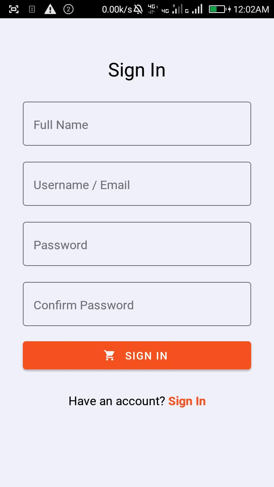

# Dot Foodies (Restaurant App)

## React Native Reastaurant App

I'm trying to understand the best way to build React Native apps. 

### Android

* Install nvm and node-12.16.3
* Install dependencies: `npm install`
* Run it: `expo start --android`

### iOS
In the root directory
* Install dependencies: `npm install`

In the `ios` directory

* Install Pods: `gem install cocoapods`
* Install Pods: `pod install`
* Install xcpretty: `gem install xcpretty`
* Run it: `expo start --ios`

### Server

There is a server that the app hits for data. The data is only stored in memory, but it should produce a more realistic environment.

In the `server` directory

* Install nvm and node-12.16.3
* Install dependencies: `npm install`
* Run it: `expo start`

## License

MIT
